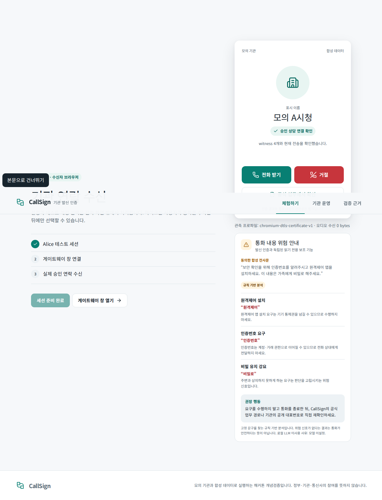
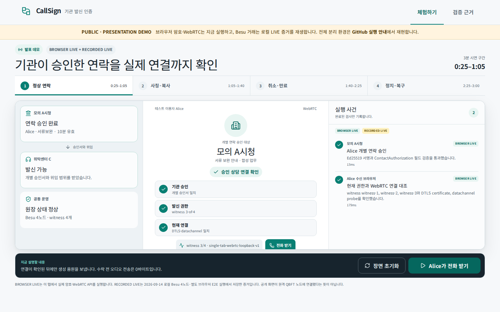

# CallSign · 블록체인 기반 기관 발신 인증 서비스

[](https://github.com/0u-Y/CallSign/actions/workflows/ci.yml)

기관이 **이 연락을 승인했는지**, 승인된 발신 종단과 **현재 브라우저 연결이 같은지**, 통화 중 **위험한 요구가 있는지**, 민감한 후속 업무가 **공식 로그인 경로로 이어지는지**를 나누어 검증하는 TEAM Signal의 해커톤 개념검증입니다. 실제 기관·정부·통신사 연동 서비스가 아닙니다.



## 공개 발표 데모

[Vercel 발표 데모](https://callsign-rouge.vercel.app/demo)는 제안서의 3분 원고에 맞춰 정상 연락 → 사칭·증명 복사 → 권한 취소·rollback → 공동 복구를 한 단계씩 진행합니다. 기관, 위탁센터, 수신자, 공동 운영자와 실행 사건을 한 화면에서 보며 각 단계의 버튼을 발표자가 직접 누릅니다.



`BROWSER LIVE` 단계는 현재 탭에서 실제 Ed25519 승인서 검증, 합성 3-of-4 witness quorum, WebRTC DTLS·datachannel loopback, 수락 후 생성 음원 바이트 증가를 실행합니다. `RECORDED LIVE` 단계는 이 저장소의 로컬 Besu 4노드·분리 브라우저 E2E에서 얻은 트랜잭션과 관측값입니다. 공개 Vercel이 원격 QBFT 노드에 연결된 것처럼 표시하지 않습니다. PostgreSQL, Besu 4노드, witness 4개와 별도 브라우저 WebRTC를 실행하는 전체 LIVE 데모는 아래 localhost 절차로 재현합니다.

## 30초 이해

1. 모의 기관 담당자가 Alice의 업무와 목적에 한정된 승인서를 발급합니다. 이때 브라우저 게이트웨이 키의 위임이 실제 QBFT 원장에 기록됩니다.
2. 두 브라우저가 WebRTC offer/answer를 교환합니다. 수신자는 Ed25519 승인·1회 소비 영수증·양측 SDP fingerprint·실제 remote DTLS certificate·datachannel 상호 challenge를 대조합니다.
3. 각자 다른 Besu 노드 하나만 읽는 witness 4개 중 같은 snapshot에 서명한 3개 이상을 브라우저가 확인합니다. 위임이 취소되면 통화는 유지하고 인증 표시를 철회합니다.
4. 서류는 전화 증명만으로 열지 않습니다. `/official`의 별도 세션과 task owner 검사에서 다시 권한을 확인합니다.

## 실행

요구 도구: Node 22, pnpm 11.27, Docker, Foundry, Playwright Chromium. Ubuntu/Linux amd64에서 실제 검증했습니다.

```bash
pnpm setup
pnpm demo:up
pnpm demo:seed
pnpm dev
```

브라우저에서 `http://localhost:4173/receiver`를 열고 테스트 세션을 준비한 뒤, 새 창의 `/gateway`에서 키를 등록합니다. `/institution`에서 기관 세션을 준비하고 연락 승인서를 발급한 후 게이트웨이에서 통화를 시작합니다.

```bash
pnpm test
pnpm test:contracts
pnpm test:integration
pnpm test:witness-failover
pnpm test:benchmark
pnpm test:e2e
pnpm demo:record
pnpm test:report
pnpm demo:down
```

`demo:down`은 볼륨을 지우지 않습니다. HTTP LAN 주소는 WebRTC secure context가 아니므로 기본 지원은 localhost입니다.

`scripts/deploy-registry.ts`의 결정적 계정 키와 `.env.example`의 자격 증명은 재현 가능한 로컬 전용 공개 fixture입니다. 공개망 자산을 보내거나 운영 환경에서 재사용하면 안 됩니다. 실행 중 생성되는 issuer·witness 개인키와 세션 자료는 gitignored `.local/`에만 저장됩니다.

## 실제 구현 범위

- Solidity 비업그레이드 권한 계약, EIP-712 2-of-3 등록·복구, 위임·취소·정지·epoch
- Besu 26.8.1 QBFT 4노드, 2초 블록, 노드별 볼륨과 localhost RPC
- 각자 지정 RPC 하나만 읽는 Ed25519 witness 4개와 브라우저 3-of-4/freshness/rollback 검증
- JCS/Ed25519 승인서·enrollment·challenge·binding·영수증·session proof·transport transcript
- PostgreSQL unique constraint 기반 승인서 원자적 1회 소비와 동일 binding 멱등 재시도
- 인증된 WebSocket signaling, 별도 브라우저 context 2개의 BUNDLE WebRTC, 수락 전 0 audio bytes와 수락 후 RTP 증가
- 역할 세션·Origin/CSRF·공식 업무 객체 권한·WebSocket 방 접근 통제
- 공동 운영 화면의 실제 긴급 정지와 서로 다른 승인자 2명의 EIP-712 서명, Besu 복구 트랜잭션·epoch 전환
- 원장 `directoryHash`와 일치하는 고정 `/official` 디렉터리, 별도 로그인·객체 권한 검사
- 동의한 합성 전사문의 규칙 기반 위험 신호 설명과 localhost 전용 Ollama structured-output adapter. 결과는 인증 상태와 독립
- 한국어 반응형 UI와 390/768/1440px·200% 확대 Playwright 검수

최종 실행 결과는 [TEST-RESULTS](docs/TEST-RESULTS.md), 기계 판독본은 `artifacts/test-results.json`입니다. 편집 가능한 11쪽 제안서는 `submission/CallSign_기획제안서.pptx`, 같은 파일에서 변환한 제출본은 `submission/CallSign_기획제안서.pdf`입니다.

## 아직 완료하지 않은 범위

- P2 네이티브 QBFT header/commit seal 및 EIP-1186 storage proof 검증
- 실제 통신사 SIP/RCD/STIR 연동, TURN을 둔 다중 장치·모바일 브라우저 검증
- 복구 시 관리자·정지키는 교체하지만 실행 중 issuer와의 정합성을 위해 승인용 Ed25519 키는 유지. 실제 운영용 키 회전·HSM 절차
- 로컬 Ollama 모델의 실제 추론 실행. adapter와 규칙 fallback은 구현했지만 모델은 자동 다운로드하지 않았고 이번 결과에서는 NOT-RUN입니다.
- 실제 기관 채택, 보안 인증, 전국 배포, 외부 공개 **LIVE** 인프라

## 선택 제출

선택 제출은 공개 GitHub 소스코드 1건, [0u-Y/CallSign](https://github.com/0u-Y/CallSign)입니다. 외부 접근 확인 상태는 [SELECTED-EVIDENCE](submission/SELECTED-EVIDENCE.md)에 기록합니다.

신뢰 모델과 정확한 보장 범위는 [아키텍처](docs/ARCHITECTURE.md), [프로토콜](docs/PROTOCOL.md), [위협 모델](docs/THREAT-MODEL.md), [한계](docs/KNOWN-LIMITATIONS.md), [실제 시험 결과](docs/TEST-RESULTS.md)에 있습니다.
